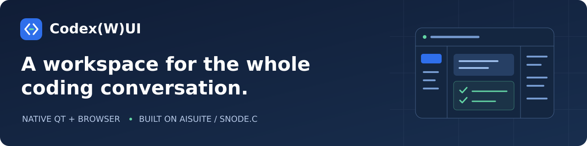
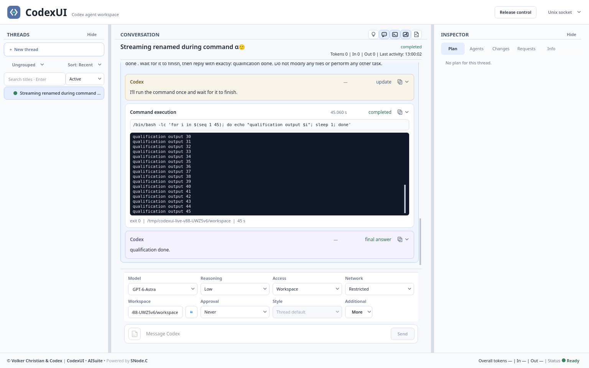

<!-- snodec:begin header -->
<a name="project-overview"></a>

<p align="center">
  
</p>

# Codex(W)UI

<picture>
  <source media="(prefers-color-scheme: dark)" srcset="docs/media/snodec-chip-dark.svg">
  
</picture>
<!-- snodec:end header -->

<!-- snodec:begin status -->
[](https://github.com/SNodeC/CodexUI/actions/workflows/ci.yml) · [](LICENSE)
<!-- snodec:end status -->

**Follow the work, not just the final answer.** Codex(W)UI offers two frontends: **CodexUI**, a native Qt desktop application, and **CodexWUI**, a browser application connecting over WebSocket. They bring conversations, commands, plans, approvals and file changes into a visual coding workspace.

Built on [AISuite](https://github.com/SNodeC/AISuite#project-overview) and [SNode.C](https://github.com/SNodeC/snode.c#project-overview), both frontends connect through AISuite's `codex-bridge`. Codex app-server remains responsible for agent execution and persistent history; both applications give you the controls and visibility around it.

<!-- snodec:begin menu -->
<p>
  <a href="#quick-start" title="Start"></a>
  <a href="#install" title="Install"></a>
  <a href="docs/build.md" title="Build"></a>
  <a href="#first-run" title="Use"></a>
  <a href="#configuration" title="Configure"></a>
  <a href="#architecture" title="Architecture"></a>
  <a href="#contributing" title="Contribute"></a>
</p>

<!-- snodec:end menu -->

## Quick start

1. [Install](#install): prepare the native or browser frontend.
2. [Use](#first-run): connect your chosen frontend and send a prompt.
3. [Configure](#configuration): review runtime settings and access controls before deployment.

## What you see

### The workspace

[](docs/media/native-workspace.png)

*Actual native application, captured during an isolated qualification session with a disposable demonstration thread. Click the image to inspect it at full resolution. [Image provenance](docs/media/README.md).*

- **Organize the work:** browse threads, search titles, archive work and return to retained history. In the native app, group threads by projects and shared sections.
- **Follow execution:** read streamed responses, reasoning summaries and command output in one conversation. Send prompts, steer an active turn, stop work and respond to approval requests.
- **Inspect results:** keep plans, agent activity, requests, changes and timing details beside the conversation. Review repository diffs, copy output and inspect the protocol when diagnosing a problem.

### A conversation you can work with

- **Rich, distinct activity cards.** Markdown, commands, file changes, plans, images and agent activity keep their own controls and presentation.
- **History without loading every widget.** Paginated history and virtualized native rendering keep offscreen content as data rather than another renderer.
- **Input beyond plain text.** The native composer accepts image paste and local file drag/drop, alongside the attachment picker and multiline editing.
- **Context when you need it.** Supplied timestamps, durations, token information and detailed Inspector views make execution easier to understand.

### Projects and sections, without duplicating threads

In the native threads panel, **projects contain the visual grouping; sections organize the threads within it**. A section can appear in multiple projects because project and section memberships are independent. Standalone sections and ungrouped threads remain visible too.

To create a project or section, click the current grouping label—**Projects**, **Sections** or **Ungrouped**—above the thread list. Use a thread's context menu to assign its project and section. Creation and assignment require controller access and server support.

[](docs/thread-projects-sections.md)

### Choose your frontend

| | CodexUI | CodexWUI |
| --- | --- | --- |
| Interface | Qt 6 Widgets | React / TypeScript |
| Connection | SNode.C transports | WebSocket |
| Install | Desktop executable | Static web assets |

**CodexUI** integrates with the Linux desktop for local workspaces, project/section organization and desktop file interaction. Installation provides `codex-ui`, a desktop entry and an icon. Available transports depend on the build.

**CodexWUI** connects through AISuite's frontend SDK without installing the Qt application. `codex-bridge` serves the built web assets; no Node runtime is required.

The frontends share protocol and lifecycle meaning, **not an identical feature inventory**. Native project/section management is not yet a browser feature. See the [browser scope and limitations](docs/web-1.0-contract.md) before choosing a deployment.

## Install

Choose your route.

**Native desktop:** Follow the [build and installation guide](docs/build.md#native-desktop) for prerequisites, compilation and the optional desktop install.

**Browser frontend:** Follow the [browser build guide](docs/build.md#browser-frontend) for static assets served by `codex-bridge`. No Qt installation or Node runtime is needed to run them.

These are source-installation routes, not a binary-package release promise.

## First run

<a id="3-connect-and-work"></a>

### Native desktop

**You need:** the native build, a configured Codex executable available to the bridge user, and AISuite's `codex-bridge`. The bridge's generated protocol targets Codex 0.154.0; use the [AISuite entry page](https://github.com/SNodeC/AISuite#project-overview) to check compatibility before changing Codex versions.

Start `codex-bridge --config-file /dev/null` as your own user in one terminal. In a second terminal, run from this checkout:

```sh
./build/codex-ui
```

The default native transport is Unix JSONL, using the same private socket as the bridge: a valid private `XDG_RUNTIME_DIR` plus `/codex-bridge.sock`, otherwise `/tmp/codex-bridge-<uid>/codex-bridge.sock`. In **Connection**, select the built transport, verify its **Socket path** (or host/port for a network transport), and choose **Apply and connect**. Dialog changes apply to this UI session; command-line/SNode.C configuration supplies startup defaults.

Wait for the provider to become ready. If you are an observer and no controller owns the session, choose **Claim control**. Controller ownership authorizes mutations on this bridge connection; it is not a login or a replacement for Codex approval/sandbox settings. Choose or create a thread and send a prompt in a disposable workspace.

**Expected result:** the thread list loads, the UI identifies your controller role, and a submitted prompt receives streamed activity and a response. A connection without provider readiness is not a successful agent run. Model requests may incur provider charges; avoid private workspaces while trying the example.

### Browser edition

After [building the browser assets](docs/build.md#browser-frontend), run this from the checkout root with AISuite's WebSocket support enabled and port **8080** free:

```sh
codex-bridge --config-file /dev/null codex --bridge-web-root "$PWD/web/app-dist" \
  codex-bridge-websocket-ipv4 --disabled=false \
  local --host 127.0.0.1 --port 8080
```

Open **http://127.0.0.1:8080/**. The page and `/codex` WebSocket share that loopback listener. Connect, claim control if it is vacant, and use a disposable thread for a first prompt. Expect the thread list and streamed response, as with the native route. For installed assets, endpoint overrides and remote deployment, use the [browser deployment guide](web/README.md#deployment); no Node server is required.

## Configuration

For native endpoints, use **Connection** as described in [First run](#first-run); startup defaults come from command-line/SNode.C settings, while the dialog applies to the current session. Browser endpoints and retained URL settings are documented in [browser deployment](web/README.md#deployment).

Controller/observer roles are routing permissions, **not authentication or tenant isolation**. Observers can receive session broadcasts and read approved workspace data, including files. Keep the Unix socket private and browser/network listeners on loopback unless an external authenticated TLS boundary protects them. App-server configuration remains authoritative for model selection, approvals and sandbox permissions.

See [UI behavior](docs/ui-behavior.md) for interaction details and [Architecture](#architecture) for component ownership.

<a id="how-it-fits-together"></a>

## Architecture

**CodexUI / CodexWUI** ↔ **AISuite bridge** ↔ **Codex app-server**

The bridge allows multiple frontends to follow the same app-server session, with one controller at a time and policy-limited observers. Controller status is distinct from the agent's approval and sandbox settings.

On the native side, a SNode.C worker owns protocol processing and writes one shared `NodeGraph`; Qt projects that state into widgets. The browser uses AISuite's TypeScript SDK and its own presentation state. Neither frontend replaces app-server's persistent history or tool execution.

For the detailed state, threading and protocol boundaries, see the [architecture guide](docs/codex-architecture.md).

## Documentation

| Start here | Go deeper |
| --- | --- |
| [UI behavior](docs/ui-behavior.md) | [Native state and threading](docs/two-thread-shared-node-graph.md) |
| [Projects and sections](docs/thread-projects-sections.md) | [Architecture overview](docs/codex-architecture.md) |
| [Timestamps and durations](docs/architecture/timestamp-presentation.md) | [Browser contract](docs/web-1.0-contract.md) |
| [Browser build and deployment](web/README.md) | [Web qualification](docs/web-qualification.md) · [Release process](docs/web-release.md) |

For bug reports, include the revision, Qt version, connection type and the smallest reproducible sequence. Remove credentials and private conversation content from logs and screenshots.

## Platforms

The documented native platform is Linux with Qt 6.6+ Widgets. Browser frontend scope, coverage and limitations are defined by the [browser contract](docs/web-1.0-contract.md); they are not a promise of native/browser feature parity.

## Releases

No GitHub release or shared binary-package distribution is published yet; the documented installation routes build from source. Future release notes belong on the [releases page](https://github.com/SNodeC/CodexUI/releases). The [web release process](docs/web-release.md) describes development qualification, not a downloadable product release.

## Contributing

[Report an issue](https://github.com/SNodeC/CodexUI/issues) using the sanitized information in [Documentation](#documentation); read the existing [engineering guidelines](AGENTS.md) and [build/qualification guide](docs/build.md#quality-and-development).

<!-- snodec:begin ecosystem -->
## Ecosystem

[SNode.C organization](https://github.com/SNodeC) · Depends on [AISuite](https://github.com/SNodeC/AISuite#project-overview) and [SNode.C](https://github.com/SNodeC/snode.c#project-overview)
<!-- snodec:end ecosystem -->

<!-- snodec:begin footer -->
Choose either [MIT](LICENSE-MIT) or [LGPL-3.0-or-later](LICENSE-LGPL-3.0-or-later).

Built with [Qt](https://www.qt.io/). Codex(W)UI is an independent project; neither frontend is an official OpenAI application.

Maintainer: [Volker Christian](https://github.com/VolkerChristian). [Organization](https://github.com/SNodeC) · [Contributing](#contributing) · [Security](https://github.com/SNodeC/.github/blob/main/SECURITY.md)
<!-- snodec:end footer -->
